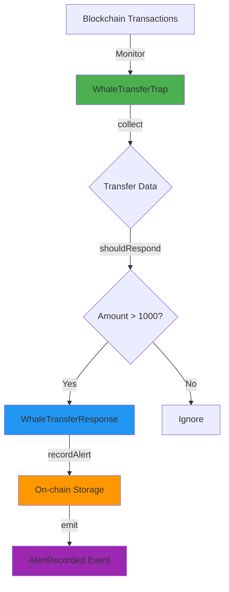

# 🐋 Whale Transaction Alert Trap

<div align="center">

[](https://drosera.io/)
[](https://soliditylang.org/)
[](https://opensource.org/licenses/MIT)
[](https://github.com/eth-clients/hoodi)

**Real-time monitoring and alerting system for large cryptocurrency transfers on the blockchain**

[Features](#-features) • [Installation](#-installation) • [Usage](#-usage) • [Documentation](#-documentation) • [Contributing](#-contributing)

</div>

---

## 📖 Table of Contents

- [Overview](#-overview)
- [Features](#-features)
- [Architecture](#%EF%B8%8F-architecture)
- [Deployed Contracts](#-deployed-contracts)
- [Installation](#-installation)
- [Quick Start](#-quick-start)
- [Configuration](#%EF%B8%8F-configuration)
- [Usage Guide](#-usage-guide)
- [Query API](#-query-api)
- [Customization](#-customization)
- [Testing](#-testing)
- [Monitoring](#-monitoring)
- [Troubleshooting](#-troubleshooting)
- [Resources](#-resources)
- [Contributing](#-contributing)
- [License](#-license)

---

## 🌟 Overview

The **Whale Transaction Alert Trap** is a sophisticated blockchain monitoring system built on the Drosera Network that detects and records large token transfers (whale movements) in real-time. When a transaction exceeds a predefined threshold, the system triggers an on-chain alert, creating an immutable record of whale activity.

### 💡 Why Whale Monitoring Matters

- **Market Intelligence**: Track institutional and whale movements
- **Risk Management**: Detect large transfers that may impact liquidity
- **Transparency**: Public, on-chain record of major transactions
- **Early Warning**: Real-time alerts for significant market events

---

## ✨ Features

<table>
<tr>
<td width="50%">

### 🎯 Core Functionality
- ✅ **Real-time Monitoring** - Continuous blockchain surveillance
- ✅ **Configurable Threshold** - Default: 1000 tokens (adjustable)
- ✅ **On-chain Storage** - Immutable alert history
- ✅ **Event Emission** - Off-chain integration ready

</td>
<td width="50%">

### 🔧 Advanced Features
- ✅ **Address Tracking** - Count alerts per wallet
- ✅ **Query API** - Retrieve alerts programmatically
- ✅ **Batch Retrieval** - Get multiple alerts efficiently
- ✅ **Block Precision** - Exact block number tracking

</td>
</tr>
</table>

---

## 🏛️ Architecture

<div align="center">



</div>

### System Flow

```
┌─────────────────────────────────────────────────────────────┐
│                  HOODI BLOCKCHAIN NETWORK                   │
│                                                             │
│  ┌────────────────┐                  ┌────────────────┐    │
│  │   Transfer A   │                  │   Transfer B   │    │
│  │  (500 tokens)  │                  │ (1500 tokens)  │    │
│  └────────┬───────┘                  └────────┬───────┘    │
│           │                                   │             │
│           └──────────┐               ┌────────┘             │
│                      ▼               ▼                      │
│         ┌────────────────────────────────────────┐          │
│         │    WhaleTransferTrap.sol               │          │
│         │  ┌──────────────────────────────────┐  │          │
│         │  │ • collect() - Gather transfers  │  │          │
│         │  │ • shouldRespond() - Check > 1k  │  │          │
│         │  └──────────────────────────────────┘  │          │
│         └──────────────┬─────────────────────────┘          │
│                        │                                     │
│                        │ ⚠️ Threshold Exceeded               │
│                        ▼                                     │
│         ┌────────────────────────────────────────┐          │
│         │  WhaleTransferResponse.sol             │          │
│         │  ┌──────────────────────────────────┐  │          │
│         │  │ • recordAlert()                  │  │          │
│         │  │ • Store: from, to, amount, block │  │          │
│         │  │ • Emit: AlertRecorded event      │  │          │
│         │  └──────────────────────────────────┘  │          │
│         └────────────────────────────────────────┘          │
│                                                             │
└─────────────────────────────────────────────────────────────┘
```

---

## 📍 Deployed Contracts

<div align="center">

| Contract Name | Address | Verified |
|--------------|---------|----------|
| **WhaleTransferResponse** | [`0xE5701AE464d94449461D224b1f11D5b55be1EC0f`](https://explorer.hoodi.io/address/0xE5701AE464d94449461D224b1f11D5b55be1EC0f) | ✅ |
| **WhaleTransferTrap** | [`0x9b06F678c4df0eF1282b03FF9FE804444F513d26`](https://explorer.hoodi.io/address/0x9b06F678c4df0eF1282b03FF9FE804444F513d26) | ✅ |

**Network**: Hoodi Testnet (Chain ID: `560048`)  
**Threshold**: `1,000 tokens` (1000 × 10¹⁸ wei)  
**Status**: 🟢 **Active & Monitoring**

</div>

---

## 📁 Project Structure

```
whale-transaction-trap/
│
├── 📂 src/
│   ├── 📄 WhaleTransferTrap.sol          # Main trap logic & threshold checking
│   ├── 📄 WhaleTransferResponse.sol      # Alert storage & event emission
│   └── 📄 IWhaleTransferResponse.sol     # Interface definition
│
├── 📂 script/
│   └── 📄 Deploy.s.sol                   # Foundry deployment script
│
├── 📂 test/
│   └── 📄 *.t.sol                        # Test files
│
├── 📄 drosera.toml                       # Drosera trap configuration
├── 📄 foundry.toml                       # Foundry project config
├── 📄 .env.example                       # Environment variables template
├── 📄 .gitignore                         # Git ignore rules
└── 📄 README.md                          # This file
```

---

## 🚀 Installation

### Prerequisites

<table>
<tr>
<td>

**System Requirements**
- Ubuntu 20.04+ or macOS
- 4GB+ RAM
- 10GB+ free disk space

</td>
<td>

**Software Requirements**
- Git
- Foundry
- Docker (for operator)
- Node.js 18+ (optional)

</td>
</tr>
</table>

### Step 1: Install Foundry

```bash
curl -L https://foundry.paradigm.xyz | bash
source ~/.bashrc
foundryup
```

### Step 2: Install Drosera CLI

```bash
curl -L https://app.drosera.io/install | bash
source ~/.bashrc
droseraup
```

### Step 3: Install Bun (JavaScript Runtime)

```bash
curl -fsSL https://bun.sh/install | bash
source ~/.bashrc
```

### Step 4: Clone Repository

```bash
git clone https://github.com/Miningelectroneum/Whale-Tx-Trap.git
cd Whale-Tx-Trap
```

### Step 5: Install Dependencies

```bash
forge install foundry-rs/forge-std --no-commit
bun install
```

### Step 6: Setup Environment

```bash
cp .env.example .env
nano .env  # Add your private key and RPC URL
```

**`.env` file structure:**
```env
HOODI_RPC_URL=https://ethereum-hoodi-rpc.publicnode.com
PRIVATE_KEY=your_private_key_here_without_0x
TRAP_CONFIG_ADDRESS=
```

### Step 7: Build Contracts

```bash
forge build
```

You should see:
```
[⠊] Compiling...
[⠒] Compiling 3 files with Solc 0.8.20
[⠢] Solc 0.8.20 finished in X.XXs
Compiler run successful!
```

---

## ⚡ Quick Start

### Deploy in 3 Commands

```bash
# 1. Build contracts
forge build

# 2. Deploy contracts
source .env
forge script script/Deploy.s.sol:DeployScript \
  --rpc-url $HOODI_RPC_URL \
  --private-key $PRIVATE_KEY \
  --broadcast -vvvv

# 3. Apply trap configuration
DROSERA_PRIVATE_KEY=$PRIVATE_KEY drosera apply
```

**📝 Important**: Save the contract addresses from the deployment output!

---

## ⚙️ Configuration

### Update `drosera.toml`

```toml
ethereum_rpc = "https://ethereum-hoodi-rpc.publicnode.com"
drosera_rpc = "https://relay.hoodi.drosera.io"
eth_chain_id = 560048
drosera_address = "0x91cB447BaFc6e0EA0F4Fe056F5a9b1F14bb06e5D"

[traps]
[traps.whaletransfer]
path = "out/WhaleTransferTrap.sol/WhaleTransferTrap.json"
response_contract = "0xYOUR_RESPONSE_CONTRACT_ADDRESS"
response_function = "recordAlert(address,address,uint256,uint256)"
cooldown_period_blocks = 33
min_number_of_operators = 1
max_number_of_operators = 2
block_sample_size = 10
private_trap = true
whitelist = ["0xYOUR_OPERATOR_WALLET_ADDRESS"]
```

### Configuration Parameters Explained

| Parameter | Description | Default |
|-----------|-------------|---------|
| `cooldown_period_blocks` | Blocks between responses | 33 |
| `min_number_of_operators` | Minimum operators required | 1 |
| `max_number_of_operators` | Maximum operators allowed | 2 |
| `block_sample_size` | Blocks to sample per check | 10 |
| `private_trap` | Restrict to whitelisted operators | true |

---

## 📚 Usage Guide

### Setting Up the Operator

#### 1. Create Operator Environment

```bash
mkdir -p ~/Drosera-Network
cd ~/Drosera-Network
```

#### 2. Create `docker-compose.yaml`

```yaml
version: '3.8'

services:
  drosera-operator:
    image: ghcr.io/drosera-network/drosera-operator:latest
    container_name: drosera-operator
    ports:
      - "31313:31313"
      - "31314:31314"
    environment:
      - DRO__DB_FILE_PATH=/data/drosera.db
      - DRO__DROSERA_ADDRESS=0x91cB447BaFc6e0EA0F4Fe056F5a9b1F14bb06e5D
      - DRO__ETH__CHAIN_ID=560048
      - DRO__ETH__RPC_URL=https://ethereum-hoodi-rpc.publicnode.com
      - DRO__ETH__PRIVATE_KEY=${ETH_PRIVATE_KEY}
      - DRO__NETWORK__EXTERNAL_P2P_ADDRESS=${VPS_IP}
    volumes:
      - drosera_data:/data
    restart: always
    command: node

volumes:
  drosera_data:
```

#### 3. Create `.env` file

```bash
ETH_PRIVATE_KEY=your_private_key
VPS_IP=your_vps_ip_address
```

#### 4. Start Operator

```bash
docker compose up -d
docker compose logs -f
```

#### 5. Register Operator

```bash
drosera-operator register \
  --eth-rpc-url https://ethereum-hoodi-rpc.publicnode.com \
  --eth-private-key your_private_key \
  --drosera-address 0x91cB447BaFc6e0EA0F4Fe056F5a9b1F14bb06e5D
```

#### 6. Opt-in to Trap

```bash
drosera-operator optin \
  --eth-rpc-url https://ethereum-hoodi-rpc.publicnode.com \
  --eth-private-key your_private_key \
  --trap-config-address your_trap_config_address
```

---

## 🔍 Query API

### Using Cast (Foundry)

#### Get Total Alert Count

```bash
cast call 0xE5701AE464d94449461D224b1f11D5b55be1EC0f \
  "getAlertCount()(uint256)" \
  --rpc-url https://ethereum-hoodi-rpc.publicnode.com
```

**Example Output**: `42` (42 whale alerts recorded)

#### Get Specific Alert by Index

```bash
cast call 0xE5701AE464d94449461D224b1f11D5b55be1EC0f \
  "getAlert(uint256)((address,address,uint256,uint256,uint256))" 0 \
  --rpc-url https://ethereum-hoodi-rpc.publicnode.com
```

**Returns**: `(from, to, amount, blockNumber, timestamp)`

#### Get Latest N Alerts

```bash
cast call 0xE5701AE464d94449461D224b1f11D5b55be1EC0f \
  "getLatestAlerts(uint256)((address,address,uint256,uint256,uint256)[])" 5 \
  --rpc-url https://ethereum-hoodi-rpc.publicnode.com
```

**Returns**: Array of the 5 most recent alerts

#### Check Whale Threshold

```bash
cast call 0x9b06F678c4df0eF1282b03FF9FE804444F513d26 \
  "getThreshold()(uint256)" \
  --rpc-url https://ethereum-hoodi-rpc.publicnode.com
```

**Returns**: `1000000000000000000000` (1000 tokens)

#### Get Alert Count for Specific Address

```bash
cast call 0xE5701AE464d94449461D224b1f11D5b55be1EC0f \
  "alertCountByAddress(address)(uint256)" 0xYOUR_WALLET_ADDRESS \
  --rpc-url https://ethereum-hoodi-rpc.publicnode.com
```

---

## 🎨 Customization

### Change Whale Threshold

**Current**: 1000 tokens  
**How to modify**:

1. Edit `src/WhaleTransferTrap.sol`:

```solidity
// Change this line:
uint256 public constant WHALE_THRESHOLD = 5000 * 10**18; // 5000 tokens
```

2. Rebuild and redeploy:

```bash
forge clean
forge build
forge script script/Deploy.s.sol:DeployScript \
  --rpc-url $HOODI_RPC_URL \
  --private-key $PRIVATE_KEY \
  --broadcast -vvvv
```

### Monitor Specific Token

Extend the `collect()` function to filter by ERC20 token address:

```solidity
function collect() external view returns (bytes memory) {
    address targetToken = 0xYOUR_TOKEN_ADDRESS;
    // Add token-specific logic here
}
```

### Adjust Cooldown Period

In `drosera.toml`:

```toml
cooldown_period_blocks = 100  # Increase from 33 to 100 blocks
```

---

## 🧪 Testing

### Run All Tests

```bash
forge test -vvv
```

### Run Specific Test

```bash
forge test --match-test testWhaleThreshold -vvvv
```

### Coverage Report

```bash
forge coverage
```

### Gas Report

```bash
forge test --gas-report
```

---

## 📊 Monitoring

### View Operator Logs

```bash
cd ~/Drosera-Network
docker compose logs -f drosera-operator
```

**What to look for**:
- ✅ `INFO Processing block 1345XXX`
- ✅ `DEBUG Collected data for trap`
- ❌ `ERROR` messages (troubleshoot if seen)

### Check Operator Status

```bash
docker ps
docker compose ps
```

### Restart Operator

```bash
docker compose restart drosera-operator
```

### View on Dashboard

1. Visit: https://app.drosera.io/
2. Connect wallet
3. Switch to **Hoodi Network**
4. Search by trap config address or wallet address

---

## 🛠️ Troubleshooting

<details>
<summary><b>🔴 Operator Not Connecting</b></summary>

**Solution**:
```bash
# Check firewall
sudo ufw status
sudo ufw allow 31313/tcp
sudo ufw allow 31314/tcp

# Restart operator
docker compose restart drosera-operator

# Check logs
docker compose logs -f
```
</details>

<details>
<summary><b>🔴 Registration Failed</b></summary>

**Solution**:
```bash
# Try manual operator version
cd ~
curl -LO https://github.com/drosera-network/releases/releases/download/v1.20.0/drosera-operator-v1.20.0-x86_64-unknown-linux-gnu.tar.gz
tar -xvf drosera-operator-v1.20.0-x86_64-unknown-linux-gnu.tar.gz
sudo cp drosera-operator /usr/bin

# Then register
drosera-operator register --eth-rpc-url https://ethereum-hoodi-rpc.publicnode.com --eth-private-key YOUR_KEY --drosera-address 0x91cB447BaFc6e0EA0F4Fe056F5a9b1F14bb06e5D
```
</details>

<details>
<summary><b>🔴 Build Errors</b></summary>

**Solution**:
```bash
# Clean and reinstall
forge clean
rm -rf lib/
forge install foundry-rs/forge-std --no-commit
forge build
```
</details>

<details>
<summary><b>🔴 Docker Issues</b></summary>

**Solution**:
```bash
# Remove all containers
docker compose down -v

# Pull fresh image
docker pull ghcr.io/drosera-network/drosera-operator:latest

# Restart
docker compose up -d
```
</details>

---

## 📖 Resources

### Documentation
- 📘 [Drosera Official Docs](https://dev.drosera.io/)
- 📗 [Foundry Book](https://book.getfoundry.sh/)
- 📙 [Hoodi Testnet Guide](https://github.com/eth-clients/hoodi)
- 📕 [Solidity Documentation](https://docs.soliditylang.org/)

### Community
- 💬 [Drosera Discord](https://discord.com/invite/drosera)
- 🐦 [Drosera Twitter](https://twitter.com/droseranetwork)
- 📺 [Video Tutorials](https://www.youtube.com/@droseranetwork)

### Tools
- 🔧 [Hoodi RPC](https://ethereum-hoodi-rpc.publicnode.com)
- 🔍 [Hoodi Explorer](https://explorer.hoodi.io/)
- 🎨 [Drosera Dashboard](https://app.drosera.io/)

### Faucets
- 💧 [Hoodi Testnet Faucet](https://github.com/eth-clients/hoodi#faucet)

---

## 🤝 Contributing

We welcome contributions from the community! Here's how you can help:

### Ways to Contribute

- 🐛 **Report Bugs**: Open an issue with detailed information
- 💡 **Suggest Features**: Share your ideas for improvements
- 📝 **Improve Documentation**: Help make docs clearer
- 🔧 **Submit Pull Requests**: Fix bugs or add features

### Contribution Process

1. **Fork** the repository
2. **Create** your feature branch
   ```bash
   git checkout -b feature/AmazingFeature
   ```
3. **Commit** your changes
   ```bash
   git commit -m 'Add: Amazing new feature'
   ```
4. **Push** to the branch
   ```bash
   git push origin feature/AmazingFeature
   ```
5. **Open** a Pull Request

### Code Style

- Follow Solidity style guide
- Add comments for complex logic
- Include tests for new features
- Update documentation

---

## 🔐 Security

### Best Practices

- ❌ **Never** commit `.env` files
- ❌ **Never** share private keys
- ✅ **Always** use environment variables
- ✅ **Always** audit contracts before mainnet
- ✅ **Always** test thoroughly on testnet

### Report Security Issues

Found a vulnerability? Please email: `security@yourdomain.com`

**Do NOT** open public issues for security vulnerabilities.

---

## 📜 License

This project is licensed under the **MIT License** - see the [LICENSE](LICENSE) file for details.

```
MIT License

Copyright (c) 2025 Whale Transaction Alert Trap

Permission is hereby granted, free of charge, to any person obtaining a copy
of this software and associated documentation files (the "Software"), to deal
in the Software without restriction, including without limitation the rights
to use, copy, modify, merge, publish, distribute, sublicense, and/or sell
copies of the Software, and to permit persons to whom the Software is
furnished to do so, subject to the following conditions:

The above copyright notice and this permission notice shall be included in all
copies or substantial portions of the Software.
```

---

## 🙏 Acknowledgments

<div align="center">

**Built with amazing tools and supported by great communities**

[](https://drosera.io/)
[](https://getfoundry.sh/)
[](https://github.com/eth-clients/hoodi)

</div>

Special thanks to:
- 🏗️ **Drosera Network** - For the amazing infrastructure
- ⚒️ **Foundry Team** - For the best Solidity toolkit
- 🌐 **Ethereum Foundation** - For Hoodi testnet
- 👥 **Open Source Community** - For continuous support

---

## 📊 Project Stats

<div align="center">


</div>

---

## 🎯 Roadmap

### Phase 1: Foundation ✅
- [x] Core trap implementation
- [x] Response contract with storage
- [x] Basic query functions
- [x] Hoodi testnet deployment

### Phase 2: Enhancement 🚧
- [ ] Multi-token support
- [ ] Advanced filtering options
- [ ] Historical data analytics
- [ ] Web dashboard

### Phase 3: Production 📅
- [ ] Mainnet deployment
- [ ] Gas optimization
- [ ] Security audit
- [ ] Advanced monitoring tools

---

## 📞 Contact & Support

<div align="center">

**Need help? Reach out!**

[](https://github.com/Miningelectroneum)
[](https://discord.com/invite/drosera)
[](https://twitter.com/yourusername)

</div>

---

## 🎉 Status

<div align="center">

### 🟢 **ACTIVE & MONITORING**

**Last Updated**: October 2025  
**Version**: 1.0.0  
**Status**: Production Ready on Hoodi Testnet

</div>

---

<div align="center">

**Made with ❤️ by the Whale Trap Team**

⭐ **Star this repo if you find it useful!** ⭐

</div>
